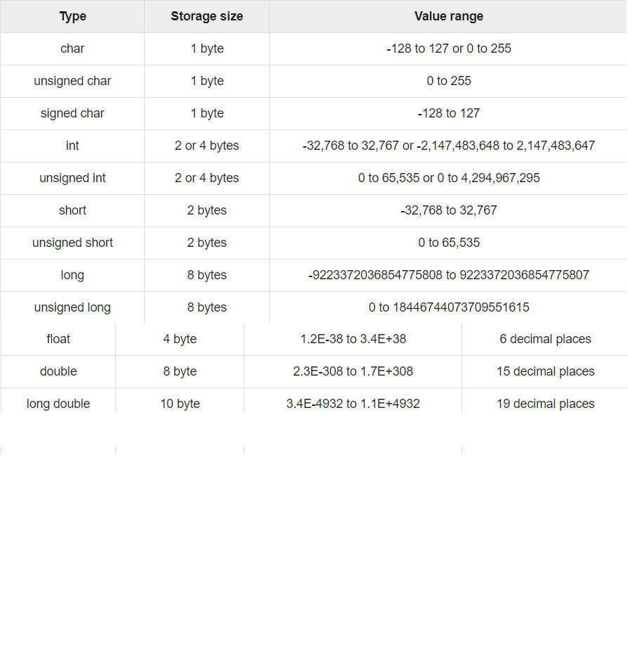
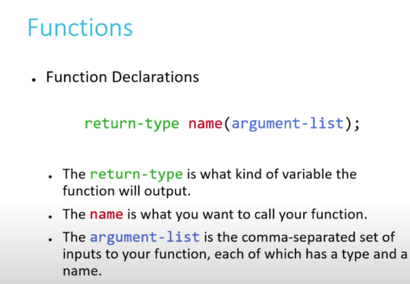
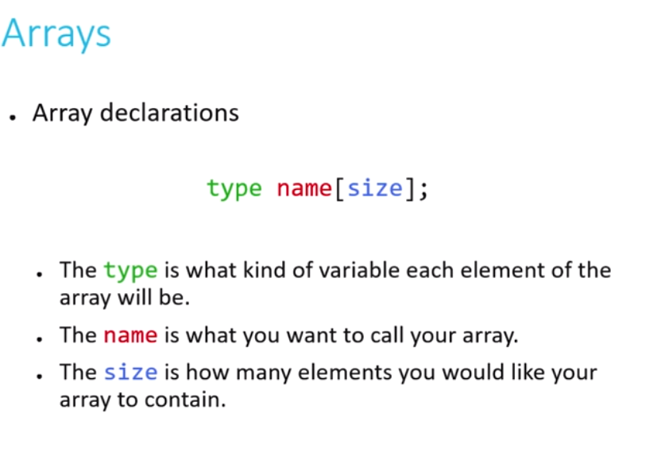

Computer Science
CS50
<https://cs50.harvard.edu/college/2020/spring/weeks/0/>

[ScratchEditor](<https://scratch.mit.edu/projects/398747679/editor>)

## Week 0

Binary was 8 light switches

If we want to represet say number 50 we turn the light bulbus
    ?  ?  ?  ?  ?   ?   ?   ?   
    1  2  4  8  16  32  64  128
        |        |    |
        on       on   on

Computer is 0 and 1
0 is 0
01 is 1
11 is two
100 is three
...

Pseudo-code
Problem: Search Mike Smith contact
    Pick up phone book
    Open to middle of phone book
    Look at page
    if Smith is on page
        Call Mike
    Else if Smith is earlier in book
        Open to middle of left half of book
        Go back to line 3
    Else if Smith is later in book
        Open to middle of right half of book
        Go back to line 3
    Else
        Quit

## Week 1

[Sandbox](<https://sandbox.cs50.io/1980a707-94f4-46c3-b86a-6a883220e19a>)

### Compiler

A program that was an input and will transform in to binary language, giving the output

clang - a compiler in C   (where clang stands for “C languages”)
ex: clang hello.c
Exucuting this comand it create a file named a.out
That file is binary code that we can't read
So if we want then to run the program that we write:

    ./a.out
    This means, to the computer run the "a.out" file in the current directory "./"

    // A program that says hello to the world in C

    #include <stdio.h>

    int main(void)
    {
        printf("hello, world\n");
    }

    >>> Terminal:
    $ clang hello.c
    $ ./a.out
    hello, world

    // if we want that the output file get personal name:
    $ clang -o hello hello.c    -> this will create a output(binary file) named hello

Variables in a string

    #inclue <cs50.h>     -> possible to use string answer in C
    #include <stdio.h>
    int main(void)
    {
        string answer = get_string("What's your name?\n");
        printf("hello, %s\n", answer);
    }
    // the %s represents the placeholder that the variable answer ill go

    >>> Terminal:
    $ make string
    // with this we can forget the clang ....

### Types, formats, operators

* There are other types we can use for our variables
    * bool, a Boolean expression of either true or false
    * char, a single character like a or 2
    * double, a floating-point value with even more digits
    * float, a floating-point value, or real number with a decimal value
    * int, integers up to a certain size, or number of bits
        * unsigned int take away the space of negative number making possible more integer number positive
    * long, integers with more bits, so they can count higher
    * string, a string of characters
* And the **CS50 library** has corresponding functions to get input of various types:
    * get_char
    * get_double
    * get_float
    * get_int
    * get_long
    * get_string
* For printf, too, there are different placeholders for each type:
    * %c for chars
    * %f for floats, doubles
    * %i for ints
    * %li for longs
    * %s for strings
* And there are some mathematical operators we can use:
    * \+ for addition
    * \- for subtraction
    * \* for multiplication
    * / for division
    * % for remainder

### Float with 2 decimal numbers

    #include <cs50.h>
    #include <stdio.h>

    int main(void)
    {
        float price = get_float("What's the price?\n$");
        printf("Your total is $%.2f.\n", price * 1.0625);
    }

Our computer has memory, in hardware chips called RAM, random-access memory. Our programs use that RAM to store data as they run, but that memory is finite. So with a finite number of bits, we can’t represent all possible numbers (of which there are an infinite number of). So our computer has a certain number of bits for each float and int, and has to round to the nearest decimal value at a certain point.

    x: 1
    y: 10
    x / y = 0.10000000149011611938476562500000000000000000000000

It turns out that this is called **floating-point imprecision**, where we don’t have enough bits to store all possible values, so the computer has to store the closest value it can to 1 divided by 10.
Exists to, **integer overflow.**

Syntactic sugar, or shortcuts that have the same effect with fewer characters to type.

## Code Week 1

    #include <stdio.h>
    // to include the get_string function
    #include <cs50.h>
    //indicating that it is a function somewhere in the code so that the main function can be in the top
    void cough(int number);
    // run while the input is negative
    int get_positive_int(string prompt);

    int main(void)
    {
        //asking the name and greetings
        string answer = get_string("what's your name?\n");
        printf("hello, %s\n",answer);

        // getting age in days
        int age = get_int("what's your age?\n");
        int days = age*365;
        printf("You age in days is %i\n",days);

        //getting the price with 2 decimal numbers
        float n = get_float("n: ");
        printf("the number with to decimal numbers is %.2f\n",n);

        //cough n times function
        int number = get_int("How many times you cough?\n");
        cough(number);

        //until number positive
        int positive = get_positive_int("Please put a positive number:");
        printf("%i\n", positive);
    }

    //function that cough n times 
    void cough(int number)
    {
        for(int i=0; i<number; i++)
        {
            printf("cough\n");
        }
    }
    // run until a positive input
    int get_positive_int(string prompt)
    {
        int n;
        do
        {
            n = get_int("%s", prompt);
        }
        while(n < 1);
        return n;
    }

### Conditions

If and else
If, else if,...
And Switch:

    #include <cs50.h>
    int x = GetInt();
    switch(x)
    {
        case 1:
        printf("one\n");
        break;
        case 2:
        printf("two\n");
        break;
        case 3:
        printf("three\n")
        break;
    }

**break** -> is for the code stop running when the condition is truth. This means that with the it doesnt have break and the conditions was realized at case 2 the output ill be: 

    output:
    two
    three

Another way of if condition:

    int x = (5<9>) ? printf("truth") : printf("false")

### Loops

**while**
 
* Use when you want a loop to repeat an unknown number of times, and possibly not at all.

**do-while**

* Use when you want a loop to repeat an unknown number of times, but at least once.

**for**

* Use when you want a loop to repeat a discrete number of times, though you may not know the number at the moment the program is compiled

## CS50 IDE

<https://us-west-2.console.aws.amazon.com/cloud9/ide/?#>

Click inside of that terminal window and then type

    mkdir ~/pset1/

followed by Enter in order to make a directory (i.e., folder) called pset1 in your home directory. Take care not to overlook the space between mkdir and ~/pset1 or any other character for that matter! Keep in mind that ~ denotes your home directory and ~/pset1 denotes a directory called pset1 within ~.

#### Listing Files

Next, in your terminal window, immediately to the right of the prompt (~/pset1/hello/ $), execute

    ls

### Compiling Programs - Options

#### Option with clang

Compiling Programs
Now, before we can execute the hello.c program, recall that we must compile it with a compiler (e.g., clang), translating it from source code into machine code (i.e., zeroes and ones). Execute the command below to do just that:

    clang hello.c

his time, you should see not only hello.c but a.out listed as well? (You can see the same graphically if you click that folder icon again.) That’s because clang has translated the source code in hello.c into machine code in a.out, which happens to stand for “assembler output,” but more on that another time.

Now run the program by executing the below.

    ./a.out

#### Option with clang and file naming

    clang -o hello hello.c

You should now see not only hello.c (and a.out from before) but also hello listed as well? That’s because -o is a command-line argument, sometimes known as a flag or a switch, that tells clang to output (hence the o) a file called hello. Execute the below to try out the newly named program.

    ./hello

#### Option make

Recall that we can automate the process of executing clang, letting make figure out how to do so for us, thereby saving us some keystrokes. Execute the below to compile this program one last time.

    make hello

You should see that make executes clang with even more command-line arguments for you? More on those, too, another time!

### How to Test Your Code

Execute the below to evaluate the correctness of your code using check50. But be sure to compile and test it yourself as well!

    check50 cs50/problems/2020/x/hello

Execute the below to evaluate the style of your code using style50.

    style50 hello.c

### How to Submit

Execute the below, logging in with your GitHub username and password when prompted. For security, you’ll see asterisks (*) instead of the actual characters in your password.

    submit50 cs50/problems/2020/x/hello

### Debugger 

To understand a bug that doesnt compile use **help50** 
If is a bug after compiling, create a stop in left side **debug50 ./bla.c** 

## Week 2

### Explicitly change types of data

    {
        char c1 = 'H';
        char c2 = 'I';
        char c3 = '!';
        printf("%i %i %i\n", (int) c1, (int) c2, (int) c3);
    }

### Arrays

In C in the arrays dont know their lenght so we need to remember for them so: 
    
    int scores[3];
    scores[0] = 72;
    scores[1] = 73;
    scores[2] = 33;
____________________________________
    #include <cs50.h>
    #include <stdio.h>

    float average(int length, int array[]);

    int main(void)
    {
        // Get number of scores
        int n = get_int("Scores:  ");

        // Get scores
        int scores[n];
        for (int i = 0; i < n; i++)
        {
            scores[i] = get_int("Score %i: ", i + 1);
        }

        // Print average
        printf("Average: %.1f\n", average(n, scores));
    }

    float average(int length, int array[])
    {
        int sum = 0;
        for (int i = 0; i < length; i++)
        {
            sum += array[i];
        }
        return (float) sum / (float) length;
    }

### String length & eficient loop

When using more than one character in C you have to use "" and with a char ''
strlen() is a function that ill give the size of the string
for this loop the condition could at is below, because all the string in the final they have null '\0'
        
        for (int i = 0; s[i] != '\0'; i++)
________
    #include <cs50.h>
    #include <stdio.h>
    #include <string.h>

    int main(void)
    {
        string s = get_string("Input: ");
        printf("Output: ");
        for (int i = 0, n = strlen(s); i < n; i++)
        {
            printf("%c", s[i]);
        }
        printf("\n");
    }

### Functions

    float multiply_floats(float float1, float float2);

    // a function that multiply two float numbers
    float multiply_floats(float float1, float float2)
    {
    return float1 * float2;
    }

### Arrays

Be caruful in C you can "escape" the bondiries of the array 

Exemplo:
    //Criation of arrays
    bool truthtable[3] = {false, true, true};
    //or:
    // bool truthtable[3];
    truthtable[0] = false;
    truthtable[1] = true;
    truthtable[2] = true;

