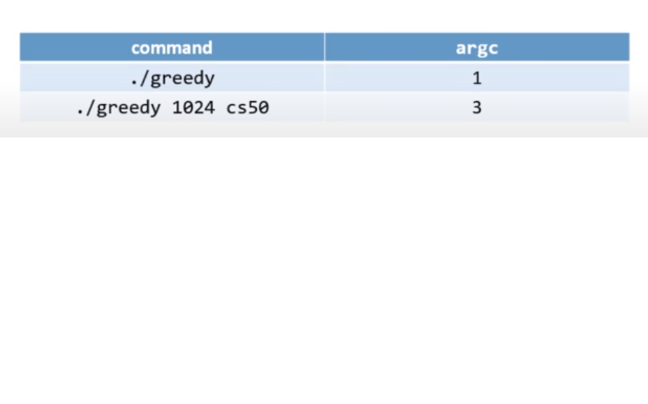

Computer Science
CS50
<https://cs50.harvard.edu/college/2020/spring/weeks/0/>

[ScratchEditor](<https://scratch.mit.edu/projects/398747679/editor>)

## Week 0

Binary was 8 light switches

If we want to represet say number 50 we turn the light bulbus
    ?  ?  ?  ?  ?   ?   ?   ?   
    1  2  4  8  16  32  64  128
        |        |    |
        on       on   on

Computer is 0 and 1
0 is 0
01 is 1
11 is two
100 is three
...

Pseudo-code
Problem: Search Mike Smith contact
    Pick up phone book
    Open to middle of phone book
    Look at page
    if Smith is on page
        Call Mike
    Else if Smith is earlier in book
        Open to middle of left half of book
        Go back to line 3
    Else if Smith is later in book
        Open to middle of right half of book
        Go back to line 3
    Else
        Quit

## Week 1

[Sandbox](<https://sandbox.cs50.io/1980a707-94f4-46c3-b86a-6a883220e19a>)

### Compiler

A program that was an input and will transform in to binary language, giving the output

clang - a compiler in C   (where clang stands for “C languages”)
ex: clang hello.c
Exucuting this comand it create a file named a.out
That file is binary code that we can't read
So if we want then to run the program that we write:

    ./a.out
    This means, to the computer run the "a.out" file in the current directory "./"

    // A program that says hello to the world in C

    #include <stdio.h>

    int main(void)
    {
        printf("hello, world\n");
    }

    >>> Terminal:
    $ clang hello.c
    $ ./a.out
    hello, world

    // if we want that the output file get personal name:
    $ clang -o hello hello.c    -> this will create a output(binary file) named hello

Variables in a string

    #inclue <cs50.h>     -> possible to use string answer in C
    #include <stdio.h>
    int main(void)
    {
        string answer = get_string("What's your name?\n");
        printf("hello, %s\n", answer);
    }
    // the %s represents the placeholder that the variable answer ill go

    >>> Terminal:
    $ make string
    // with this we can forget the clang ....

### Types, formats, operators

* There are other types we can use for our variables
    * bool, a Boolean expression of either true or false
    * char, a single character like a or 2
    * double, a floating-point value with even more digits
    * float, a floating-point value, or real number with a decimal value
    * int, integers up to a certain size, or number of bits
        * unsigned int take away the space of negative number making possible more integer number positive
    * long, integers with more bits, so they can count higher
    * string, a string of characters
* And the **CS50 library** has corresponding functions to get input of various types:
    * get_char
    * get_double
    * get_float
    * get_int
    * get_long
    * get_string
* For printf, too, there are different placeholders for each type:
    * %c for chars
    * %f for floats, doubles
    * %i for ints
    * %li for longs
    * %s for strings
* And there are some mathematical operators we can use:
    * \+ for addition
    * \- for subtraction
    * \* for multiplication
    * / for division
    * % for remainder

### Float with 2 decimal numbers

    #include <cs50.h>
    #include <stdio.h>

    int main(void)
    {
        float price = get_float("What's the price?\n$");
        printf("Your total is $%.2f.\n", price * 1.0625);
    }

Our computer has memory, in hardware chips called RAM, random-access memory. Our programs use that RAM to store data as they run, but that memory is finite. So with a finite number of bits, we can’t represent all possible numbers (of which there are an infinite number of). So our computer has a certain number of bits for each float and int, and has to round to the nearest decimal value at a certain point.

    x: 1
    y: 10
    x / y = 0.10000000149011611938476562500000000000000000000000

It turns out that this is called **floating-point imprecision**, where we don’t have enough bits to store all possible values, so the computer has to store the closest value it can to 1 divided by 10.
Exists to, **integer overflow.**

Syntactic sugar, or shortcuts that have the same effect with fewer characters to type.

# Code Week 1

    #include <stdio.h>
    // to include the get_string function
    #include <cs50.h>
    //indicating that it is a function somewhere in the code so that the main function can be in the top
    void cough(int number);
    // run while the input is negative
    int get_positive_int(string prompt);

    int main(void)
    {
        //asking the name and greetings
        string answer = get_string("what's your name?\n");
        printf("hello, %s\n",answer);

        // getting age in days
        int age = get_int("what's your age?\n");
        int days = age*365;
        printf("You age in days is %i\n",days);

        //getting the price with 2 decimal numbers
        float n = get_float("n: ");
        printf("the number with to decimal numbers is %.2f\n",n);

        //cough n times function
        int number = get_int("How many times you cough?\n");
        cough(number);

        //until number positive
        int positive = get_positive_int("Please put a positive number:");
        printf("%i\n", positive);
    }

    //function that cough n times 
    void cough(int number)
    {
        for(int i=0; i<number; i++)
        {
            printf("cough\n");
        }
    }
    // run until a positive input
    int get_positive_int(string prompt)
    {
        int n;
        do
        {
            n = get_int("%s", prompt);
        }
        while(n < 1);
        return n;
    }

### Conditions

If and else
If, else if,...
And Switch:

    #include <cs50.h>
    int x = GetInt();
    switch(x)
    {
        case 1:
        printf("one\n");
        break;
        case 2:
        printf("two\n");
        break;
        case 3:
        printf("three\n")
        break;
    }

**break** -> is for the code stop running when the condition is truth. This means that with the it doesnt have break and the conditions was realized at case 2 the output ill be: 

    output:
    two
    three

Another way of if condition:

    int x = (5<9>) ? printf("truth") : printf("false")

### Loops

**while**
 
* Use when you want a loop to repeat an unknown number of times, and possibly not at all.

**do-while**

* Use when you want a loop to repeat an unknown number of times, but at least once.

**for**

* Use when you want a loop to repeat a discrete number of times, though you may not know the number at the moment the program is compiled

## CS50 IDE

<https://us-west-2.console.aws.amazon.com/cloud9/ide/?#>

Click inside of that terminal window and then type

    mkdir ~/pset1/

followed by Enter in order to make a directory (i.e., folder) called pset1 in your home directory. Take care not to overlook the space between mkdir and ~/pset1 or any other character for that matter! Keep in mind that ~ denotes your home directory and ~/pset1 denotes a directory called pset1 within ~.

#### Listing Files

Next, in your terminal window, immediately to the right of the prompt (~/pset1/hello/ $), execute

    ls

### Compiling Programs - Options

#### Option with clang

Compiling Programs
Now, before we can execute the hello.c program, recall that we must compile it with a compiler (e.g., clang), translating it from source code into machine code (i.e., zeroes and ones). Execute the command below to do just that:

    clang hello.c

his time, you should see not only hello.c but a.out listed as well? (You can see the same graphically if you click that folder icon again.) That’s because clang has translated the source code in hello.c into machine code in a.out, which happens to stand for “assembler output,” but more on that another time.

Now run the program by executing the below.

    ./a.out

#### Option with clang and file naming

    clang -o hello hello.c

You should now see not only hello.c (and a.out from before) but also hello listed as well? That’s because -o is a command-line argument, sometimes known as a flag or a switch, that tells clang to output (hence the o) a file called hello. Execute the below to try out the newly named program.

    ./hello

#### Option make

Recall that we can automate the process of executing clang, letting make figure out how to do so for us, thereby saving us some keystrokes. Execute the below to compile this program one last time.

    make hello

You should see that make executes clang with even more command-line arguments for you? More on those, too, another time!

### How to Test Your Code

Execute the below to evaluate the correctness of your code using check50. But be sure to compile and test it yourself as well!

    check50 cs50/problems/2020/x/hello

Execute the below to evaluate the style of your code using style50.

    style50 hello.c

### How to Submit

Execute the below, logging in with your GitHub username and password when prompted. For security, you’ll see asterisks (*) instead of the actual characters in your password.

    submit50 cs50/problems/2020/x/hello

### Debugger 

To understand a bug that doesnt compile use **help50** 
If is a bug after compiling, create a stop in left side **debug50 ./bla.c** 

## Week 2

### Explicitly change types of data

    {
        char c1 = 'H';
        char c2 = 'I';
        char c3 = '!';
        printf("%i %i %i\n", (int) c1, (int) c2, (int) c3);
    }

We can take the number of a char (ASCII) and sum or subtract to get another char, like the uppercase for example. 

### Arrays

In C in the arrays dont know their lenght so we need to remember for them so: 
    
    int scores[3];
    scores[0] = 72;
    scores[1] = 73;
    scores[2] = 33;
____________________________________
    #include <cs50.h>
    #include <stdio.h>

    float average(int length, int array[]);

    int main(void)
    {
        // Get number of scores
        int n = get_int("Scores:  ");

        // Get scores
        int scores[n];
        for (int i = 0; i < n; i++)
        {
            scores[i] = get_int("Score %i: ", i + 1);
        }

        // Print average
        printf("Average: %.1f\n", average(n, scores));
    }

    float average(int length, int array[])
    {
        int sum = 0;
        for (int i = 0; i < length; i++)
        {
            sum += array[i];
        }
        return (float) sum / (float) length;
    }

### String length & eficient loop

When using more than one character in C you have to use "" and with a char ''
strlen() is a function that ill give the size of the string
for this loop the condition could at is below, because all the string in the final they have null '\0'
        
        for (int i = 0; s[i] != '\0'; i++)
________
    #include <cs50.h>
    #include <stdio.h>
    #include <string.h>

    int main(void)
    {
        string s = get_string("Input: ");
        printf("Output: ");
        for (int i = 0, n = strlen(s); i < n; i++)
        {
            printf("%c", s[i]);
        }
        printf("\n");
    }

**strlen(s)** ill give us the length of the string, we need to had the library <string.h>

### Functions

    float multiply_floats(float float1, float float2);

    // a function that multiply two float numbers
    float multiply_floats(float float1, float float2)
    {
    return float1 * float2;
    }

### Arrays

Be caruful in C you can "escape" the bondiries of the array 

    Exemplo:
    //Criation of arrays
    bool truthtable[3] = {false, true, true};
    //or:
    // bool truthtable[3];
    truthtable[0] = false;
    truthtable[1] = true;
    truthtable[2] = true;

If you already know the number and the what put inside the array you could:
Static initialized array:

    int number[6] = { 4, 8, 15, 16, 23, 42};

### Command-Line Arguments

Instead of :

    int main(void){

    }

We know ill use the :

    int main(int argc, string argv[]){

    }

The reason is that instead of use get_int, etc with this two special arguments enable you to know what data the user provided at the command line and how much data they provided.

**argc**  -> intiger, ill give the number of command-lines the user typed when the program was executed ( it counts the start of the program)

**argv** -> array (called vector two), that ill store in which element the actual text the user typed at the command-line when the program was executed.

* The first element of argv is always found at argv[0]. The last element of argv is always found at argv[argc-1].

### Variables and Scope

If a variable is declared outside of all functions, any function may refer to it.

We can use the **const** keyword to tell the compiler that the **value of N should never be changed by our program.** And by convention, we’ll place our **declaration of the variable outside of the main function** and capitalize its name, which isn’t necessary for the compiler but shows other humans that this variable is a constant and makes it easy to see from the start.

### Compiling

* We compiled it with **clang hello.c** to be able to run ./a.out (the default name), and then **clang -o hello hello.c** (passing in a command-line argument for the output’s name) to be able to run ./hello.
* We wanted to use CS50’s library, via #include <cs50.h>, for strings and the get_string function, we also have to add a flag: **clang -o hello hello.c -lcs50.** The -l flag links the cs50 file.

“Compiling” source code into machine code is actually made up of smaller steps:
* preprocessing
* compiling
* assembling
* linking

**Preprocessing** involves looking at lines that start with a #, like #include, before everything else. For example, #include <cs50.h> will tell clang to look for that header file first, since it contains content that we want to include in our program. Then, clang will essentially replace the contents of those header files into our program.

**Compiling** takes our source code, in C, and converts it to assembly code.

The next step is to take the **assembly** code and translate it to instructions in binary by assembling it. The instructions in binary are called machine code, which a computer’s CPU can run directly.

The last step is **linking,** where the contents of previously compiled libraries that we want to link, like cs50.c, are actually combined with the binary of our program. So we end up with one binary file, a.out or hello, that is the compiled version of hello.c, cs50.c, and printf.c.

### Debugging & Style

Run **debug50 ./buggy2,** we’ll see the debugger panel open on the right.

**style50** is another program that will check our code for aesthetic issues, such as whitespace, such that our code is more readable and maintainable. 

[Style Sheet in C](<https://cs50.readthedocs.io/style/c/>)

# Code week 3

## Custom types

    typedef struct
    {
        string names;
        string numbers;
    }
    person;

This means that now is a "person" type (outside main)

    int main(void)
    {
        person people[4];
        people[0].name = "EMMA";
        people[0].number = "617-555-0100";

        people[1].name = "RODRIGO";
        people[0].number = "617-555-0101";
        .
        .
        .
    }

## Algotithms

### Recursion

Recursion is a function that call it self
    
    void draw(int h)
    {
        if (h == 0)
        {
            return;
        }

        draw(h-1);

        for (int i = 0; i < h; i++)
        {
            printf("#");
        }
        printf("\n");
    }
___________________________
    #include <cs50.h>
    #include <stdio.h>

    int collatz(int n);

    int main (void)
    {
        int colat = collatz(3);
        printf("collatz: %i\n", colat);
    }

    int collatz(int n)
    {
        if (n == 1)
        {
            return 0;
        }
        else if(n % 2 == 0)
        {
            return 1 + collatz (n / 2);
        }
        else
        {
            return 1 + collatz (3 * n + 1);
        }
    }

### Call Stack

To understand recursion you need to understand the call stack, in the example above, all functions are called until the last one (the top) returns, then the other that here waiting ill be called one at a time from top to bottom.

[call-stack video](https://www.youtube.com/watch?v=aCPkszeKRa4)

### Efeciency
*O* -> in order of... worst cases.

Computer scientists might also use big Ω, big Omega notation, which is the lower bound of number of steps for our algorithm. (Big O is the upper bound of number of steps, or the worst case, and typically what we care about more.) 

This is said to understand the speed of the algorithms, like in order of O(n) , O(n/2), O(log n)

*Omega* -> oposite of *o*, (*o* is worst cases), omega is **best cases**.

Omega (1) -> represent the best chance to find, the best case.

*O*(n) -> is the worst case, we have to see truth every single element and dont find what we are looking for

* Linear Search : *O*(n) / omega(1)
    - Pass truth the data (1 by 1) until finds what we are looking for

* Binary search: *O*(log n)/ Omega(1)
    - The data was to be sorted
    - Log n means that is dividing and dividing but dont found *O*(log n)

* Buble sort  (search) : *O*(n2) / omega(n) -> the most inneficience
    - Swap adjacent pair if the left is bigger swap them making the smallest in the right
    - In the worst case you have to sort the bigger number to the right and sort the smalest number to the left, making **n2** 
    - But if in the best case scenario is already sorted so omega n, to pass only once in to the n data.

* Selection Sort : *O*(n2) / omega(n2)
    - find the smallest element in the array
    - swap smallest element with the "first number ([n+count])"
    - n2 means that it was to pass n times truth n times to sort

*Omega* -> oposite of *o*, (*o* is worst cases), omega is best cases

Omega (1) -> represent the best chance to find, the best case.

#### Sorting - merge sort
Better eficience:
*O* and omega (n log n); 
Log n means that is dividing and dividing 
In the image below in (8 log 8)

* In merge sort, the idea of the algorithm is to sort smaller arrays and then combine those arrays together (merge them) in sorted order.
* Moresort leverage something called recursion

In pseudocode:
* Sort the left half of the array (assuming n> 1)
* Sort the right half of the array (assuming n> 1)
* Merge the two halves together

[Merge-Sort video](<https://www.youtube.com/watch?v=Ns7tGNbtvV4>)

## Week 4

### Memory

* It turns out that, by convention, the addresses for memory use the counting system hexadecimal, where there are 16 digits, 0-9 and A-F.

* Recall that, in binary, each digit stood for a power of 2:
    
    128 64 32 16  8  4  2  1
      1  1  1  1  1  1  1  1

With 8 bits, we can count up to 255.

* It turns out that, in hexadecimal, we can perfectly count up to 8 binary bits with just 2 digits:

    16^1 16^0
       F    F

Here, the F is a value of 15 in decimal, and each place is a power of 16, so the first F is 16^1 * 15 = 240, plus the second F with the value of 16^0 * 15 = 15, for a total of 255.

#### Pointers

* In our computer’s memory, there are now 4 bytes somewhere that have the binary value of 50, labeled n
* It turns out that, with the billions of bytes in memory, those bytes for the variable n starts at some unique address that might look like 0x12345678 (arbitrary number).
* In C, we can actually see the address with the **& operator,** which means “get the address of this variable”:
   
        #include <stdio.h>

        int main(void)
        {
            int n = 50;
            printf("%p\n", &n);
        }

* The address of a variable is called a pointer, which we can think of as a value that “points” to a location in memory. The **\* operator** lets us “go to” the location that a pointer is pointing to.
* For example, we can print *&n, where we “go to” the address of n, and that will print out the value of n, 50, since that’s the value at the address of n
* We also have to use the * operator (in an unfortunately confusing way) to declare a variable that we want to be a pointer:

        #include <stdio.h>

        int main(void)
        {
        int n = 50;
        int *p = &n;
        printf("%p\n", p);
        }

* int* p; -> declaring a pointer
* int* p = &n; -> giving p the adress 0x123456 (p = 0x123456)
* int *p = &n; -> gives the value that is in the adress 0x123456 (p = 50)

#### String

* We might have a variable string s for a name like EMMA, and be able to access each character with s[0] and so on.
* But it turns out that each character is in stored in memory at a byte with some address, and s is actually just a pointer with the address of the first character
* And since s is just a pointer to the beginning, only the \0 indicates the end of the string.
* This is familiar, but we can just say (string == char* , that string is given by the Library CS50)

        #include <stdio.h>

        int main(void)
        {
            char *s = "EMMA";
            printf("%s\n", s);
        }
        //output : 0x132456
____
        #include <stdio.h>

        int main(void)
        {
            char *s = "EMMA";
            printf("%c\n", *s);
            printf("%c\n", *(s+1));
        }
        //output : 
            E
            M
* \* -> This means go to
* \& -> This means the adress
* printf -> have the config to print the beginning the adress until \0 (null)

To copy a string :

        string s = "EMMA";
        string t = s;
        // e se depois quisermos alterar algo na variavel t
        t[0] = toupper(t[0]);
        // isto vai alterar a variavel s tambem, pois t esta a apontar para a "adress" de s.
______________

* To actually make a copy of a string, we have to do a little more work:

        #include <cs50.h>
        #include <ctype.h>
        #include <stdio.h>
        #include <string.h>

        int main(void)
        {
            char *s = get_string("s: ");

            char *t = malloc(strlen(s) + 1);

            for (int i = 0, n = strlen(s); i < n + 1; i++)
            {
                t[i] = s[i];
            }

            t[0] = toupper(t[0]);

            printf("s: %s\n", s);
            printf("t: %s\n", t);

            free(t);
        }

* With **malloc,** we can allocate some number of bytes in memory (that aren’t already used to store other values), and we pass in the number of bytes we’d like. We already know the length of s, so we add 1 to that for the terminating null character(\0). So, our final line of code is char *t = malloc(strlen(s) + 1);.
* **Malloc** ill for ever allocate the adress unless we use **free()**
    - **free(t)** ill free the memory, use it when you dont need anymore t
* We can actually also use the strcpy library function with strcpy(t, s) instead of our loop, to copy the string s into t.
* what if malloc() can't give you memory? it'll hand you back null so is better to always condition the variable right after malloc to see if == NULL
* int *px = malloc(sizeof(int)); -> ill find 4 bytes in heat
* float* heap_array = malloc(x * sizeof(float)); -> this ill give a space in memory x times a size of a float

Rules: 
* Every you malloc you should right after you dont need it
* Do not free() a block of memory more than once
* Only memory that you malloc() should be free().

#### valgrind

* It turns out that, after we’re done with memory that we’ve allocated with malloc, we should call free (as in free(t)), which tells our computer that those bytes are no longer useful to our program, so those bytes in memory can be reused again.
* If we kept running our program and allocating memory with malloc, but never freed the memory after we were done using it, we would have a memory leak, which will slow down our computer and use up more and more memory until our computer runs out.
* valgrind is a command-line tool that we can use to run our program and see if it has any memory leaks. We can run valgrind on our program above with help50 valgrind ./copy and see, from the error message, that line 10, we allocated memory that we never freed (or “lost”).

        valgrind ./copy

### Swap

* Now, let’s say we wanted to swap the values of two integers.

        #include <stdio.h>

        void swap(int a, int b);

        int main(void)
        {
            int x = 1;
            int y = 2;

            printf("x is %i, y is %i\n", x, y);
            swap(x, y);
            printf("x is %i, y is %i\n", x, y);
        }

        void swap(int a, int b)
        {
            int tmp = a;
            a = b;
            b = tmp;
        }

 But, if we tried to use that function in a program, we don’t see any changes
 
 By passing in the address of x and y, our swap function can actually work:

        #include <stdio.h>

        void swap(int *a, int *b);

        int main(void)
        {
            int x = 1;
            int y = 2;

            printf("x is %i, y is %i\n", x, y);
            swap(&x, &y);
            printf("x is %i, y is %i\n", x, y);
        }

        void swap(int *a, int *b)
        {
            int tmp = *a;
            *a = *b;
            *b = tmp;
        }

### Memory layout

* The machine code section is our compiled program’s binary code. When we run our program, that code is loaded into the “top” of memory.
* Globals are global variables we declare in our program or other shared variables that our entire program can access.
* The heap section is an empty area where malloc can get free memory from, for our program to use.
* The stack section is used by functions in our program as they are called. For example, our main function is at the very bottom of the stack, and has the local variables x and y. The swap function, when it’s called, has its own frame, or slice, of memory that’s on top of main’s, with the local variables a, b, and tmp

### get_int / get_string

* We can implement get_int ourselves with a C library function, scanf:
      
        #include <stdio.h>

        int main(void)
        {
            int x;
            printf("x: ");
            scanf("%i", &x);
            printf("x: %i\n", x);
        }

* scanf takes a format, %i, so the input is “scanned” for that format, and the address in memory where we want that input to go. But scanf doesn’t have much error checking, so we might not get an integer.

We can try to get a string the same way:

        #include <stdio.h>

        int main(void)
        {
            char *s = NULL;
            printf("s: ");
            scanf("%s", s);
            printf("s: %s\n", s);
        }

* But we haven’t actually allocated any memory for s (s is NULL, or not pointing to anything), so we might want to call char s[5] to allocate an array of 5 characters for our string. Then, s will be treated as a pointer in scanf and printf.

Now, if the user types in a string of length 4 or less, our program will work safely. But if the user types in a longer string, scanf might be trying to write past the end of our array into unknown memory, causing our program to crash.

### Files

* With the ability to use pointers, we can also open files:

        #include <cs50.h>
        #include <stdio.h>
        #include <string.h>

        int main(void)
        {
            // Open file
            FILE *file = fopen("phonebook.csv", "a");

            // Get strings from user
            char *name = get_string("Name: ");
            char *number = get_string("Number: ");

            // Print (write) strings to file
            fprintf(file, "%s,%s\n", name, number);

            // Close file
            fclose(file);
        }

* fopen is a new function we can use to open a file. **It will return a pointer to a new type, FILE,** that we can read from and write to. The first argument is the name of the file, and the second argument is the mode we want to open the file in **(r for read, w for write, and a for append, or adding to)**.
* After we get some strings, we can use fprintf to print to a file.
* Finally, we close the file with fclose.
* Now we can create our own CSV files, files of comma-separated values (like a mini-spreadsheet), programmatically.

#### File Pointers

* fopen()
    - Opens a file and returns a file pointer to it
    - Always check the return value to mkae sure you dont get back NULL.

             FILE* ptr = fopen(<filename>, <operation>);

    - \<operation>:
        * r - for read
        * w - for write (ill overwrite if the file has already written)
        * a - for append or add (the difference of write is that ill add in the end of the file)
    * Important to understand that the operation is how we ill work in that file and imagine that we want to write and read, you ill have to do 2 opens one with operator "w" and other with "r"
* fclose()
    - Closes the file pointed to by the given file pointer

            fclose(<file pointer>);
* fgetc()
    - need the file to be open was "r" reading
    - it ill give you the next chararacter of the file

            char ch = fgetc(<file pointer>);

        * Example of use (priting all the text of a file in the terminal):

                char ch;
                while((ch = fgetc(ptr)) != EOF)
                    printf("%c", ch);
                
            - EOF - means end of the file

* fputc()
    - Writes or appends the specified character to the pointed-to file.
    - The operation in the file pointer must be "w" or "a"

            fputc(<character>, <file pointer>);

* fread()
    - Is like fgetc() but is not limited to one char at a time
    - Reads \<qty> units of size \<size> from the file pointed to and stores them in memory in a buffer (usually an array) pointed to by \<buffer>.

            fread(<buffer>, <size>, <qty>, <file pointer>);

        - Example :

                int arr[10];
                fread(arr, sizeof(int), 10, ptr);

                char c;
                fread( &c, sizeof(char), 1, ptr);

            - &c because the buffer is a pointer so we need to give the adress

* fwrite()
    * Simialiar with fread() but writes instead of read

            fwrite(<buffer>, <size>, <qty>, <file pointer>);

* More file pointers:

### Comparing files

* We can also write a program that opens a file and tells us if it’s a JPEG (image) file:

        #include <stdio.h>

        int main(int argc, char *argv[])
        {
            // Check usage
            if (argc != 2)
            {
                return 1;
            }

            // Open file
            FILE *file = fopen(argv[1], "r");
            if (!file)
            {
                return 1;
            }

            // Read first three bytes
            unsigned char bytes[3];
            fread(bytes, 3, 1, file);

            // Check first three bytes
            if (bytes[0] == 0xff && bytes[1] == 0xd8 && bytes[2] == 0xff)
            {
                printf("Maybe\n");
            }
            else
            {
                printf("No\n");
            }

            // Close file
            fclose(file);
        }

* Now, if we run this program with ./jpeg brian.jpg, our program will try to open the file we specify (checking that we indeed get a non-NULL file back), and read the first three bytes from the file with fread.
* We can compare the first three bytes (in hexadecimal) to the three bytes required to begin a JPEG file. If they’re the same, then our file is likely to be a JPEG file (though, other types of files may still begin with those bytes). But if they’re not the same, we know it’s definitely not a JPEG file.

## Week 5 Data Structure

* realloc()
  - realocate new memory, in the example below you realocate a memory of 3 ints to 4 ints and now you can pass new data to the structure
    
            int main(void)
        {
            // List of size 3
            int *list = malloc(3 * sizeof(int));
            if (list == NULL)
            {
                return 1;
            }

            // Initialize list of size 3 with numbers
            list[0] = 1;
            list[1] = 2;
            list[2] = 3;

            // Resize list to be of size 4
            int *tmp = realloc(list, 4 * sizeof(int));
            if (tmp == NULL)
            {
                return 1;
            }
            list = tmp;

            // Add number to list
            list[3] = 4;

            // Print list
            for (int i = 0; i < 4; i++)
            {
                printf("%i\n", list[i]);
            }

            // Free list
            free(list);
        }

#### Data Structure

* struct
* . -> to get acess to the property of the data structure
* \* -> go to a chucnk of memory

# Functions

### #include <stdio.h>

### #include <cs50.h>

### #include <string.h>

* strcpy(t, s)
    - Copy the string in variable s to the variable t
* strlen()
    - calculates the length of the string pointed to by s, excluding the terminating null byte ('\0')
* if (strcmp(("EMMA", "EMMA") == 0)
    - Compare to strings and return 0 when match